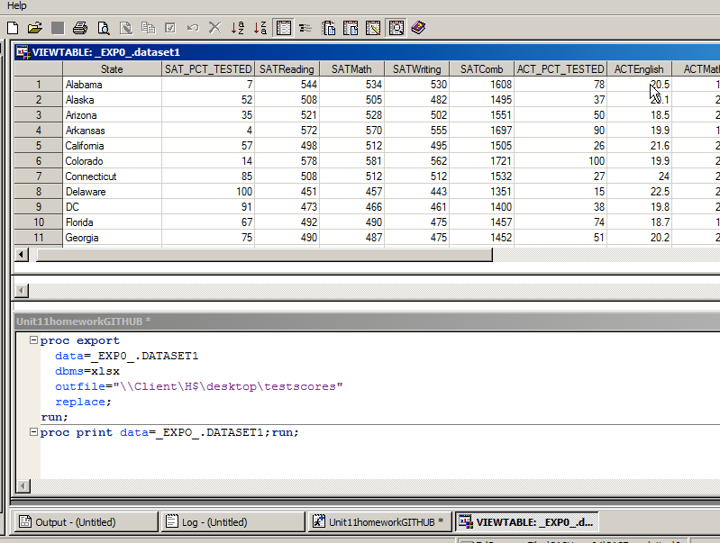

#This is the post live assignment for MSDS 6306-401 Unit 11.  

## Summary
.sas7bdat file INTO SAS -> .sas7bdat file EXPORTED from SAS to EXCEL FILE -> EXCEL FILE to GITHUB

##Download the zip file from the 2DS site.   Upload the Dataset1.sas7bdat file into SAS Citrix by clicking on the GUI (this is the tricky part-you have to find the acutal local drive.  It will take multiple clicks).   Next you will see a view table with the dataset populate in your main SAS screen.  Click on the log tab at the bottom to find 51 observations and 14 variables.  Input the code below to export this data into .xls format.

proc export 
  data=_EXP0_.DATASET1 
  dbms=xlsx
  outfile="\\Client\H$\desktop\testscores"
  replace;
  run;
  
  

###Find the file named "testscores.xlsx", add the assigned additional data and push it up to GITHUB

To download the excel file click to the right. 

###Appendix

See the SAS Screen of code and data set: [] (https://github.com/ChrisWSMU/SAStoXLSX/blob/master/Images/Unit11SAShomeworkScreen.png)

